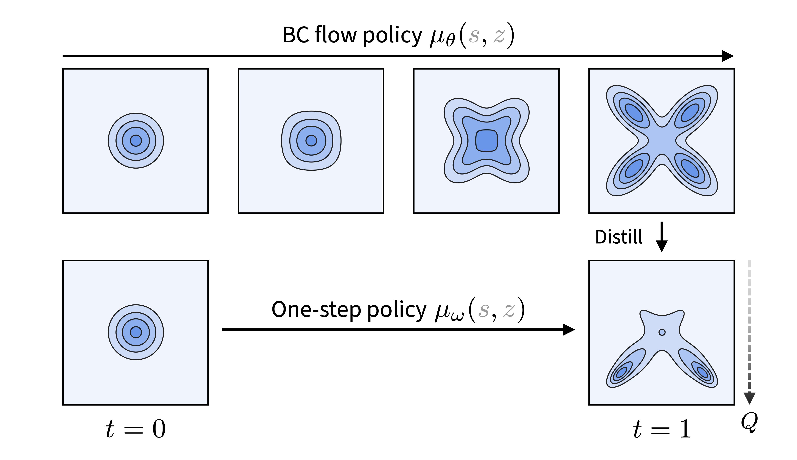

<div align="center">

<div id="user-content-toc" style="margin-bottom: 50px">
  <ul align="center" style="list-style: none;">
    <summary>
      <h1>Flow Q-Learning</h1>
      <br>
      <h2><a href="https://arxiv.org/abs/2502.02538">Paper</a> &emsp; <a href="https://seohong.me/projects/fql/">Project page</a></h2>
    </summary>
  </ul>
</div>



</div>

# Flow Q-Learning (FQL)

This repository implements Flow Q-Learning (FQL) and Implicit Flow Q-Learning (IFQL) agents for offline reinforcement learning.

## 🚀 Quick Start & Environment Compatibility

This codebase works across different environments including Google Colab, Jupyter notebooks, and local installations.

### Option 1: Google Colab Setup (recommended)
```python
# Step 1: In a Colab cell, run this to set up everything:
exec(open('colab_setup.py').read())

# Step 2: Restart Python kernel (Runtime -> Restart runtime)

# Step 3: Test the installation:
exec(open('test_mujoco_py.py').read())

# Step 4: If tests pass, run training:
!python main.py --env_name=antmaze-medium-play-v0 --agent.kl_coeff=0.3
```

### Option 2: Manual mujoco-py installation
```bash
# For advanced users - install mujoco-py manually
python install_mujoco_py.py

# Then run training directly
python main.py --env_name=antmaze-medium-play-v0 --agent.kl_coeff=0.3
```

### Option 3: Automatic compatibility patches
```bash
# Works with newer mujoco - patches applied automatically
python main.py --env_name=antmaze-medium-play-v0 --agent.kl_coeff=0.3
```

### Option 4: Explicit patch application
```bash
# If automatic patching doesn't work, use this
python run_with_patches.py --env_name=antmaze-medium-play-v0 --agent.kl_coeff=0.3
```

### Environment Detection
The code automatically detects your environment:
- **Google Colab**: Applies mujoco_py compatibility patches
- **Jupyter**: Handles Jupyter-specific issues  
- **Local**: Minimal patching, uses existing installations

### 🧪 Testing Your Setup
Before running training, test your environment compatibility:

```bash
# Test if your environment is properly configured
python test_compatibility.py
```

This will check:
- ✅ JAX installation and GPU/CPU detection
- ✅ MuJoCo vs mujoco_py compatibility
- ✅ D4RL import functionality  
- ✅ Environment creation
- ✅ Automatic patch application

If tests pass, you're ready to train! If not, the script will suggest fixes.

## New Feature: KL Pessimism

Both FQL and IFQL agents now support KL pessimism to prevent Q-function overestimation on out-of-distribution (OOD) actions. This is implemented as a penalty term in the critic loss that constrains the Q-values of policy-generated actions relative to buffer actions.

### How it works:

1. **Sample actions from current policy**: During critic training, we sample actions from the current policy for each state in the batch
2. **Compute Q-values**: Evaluate Q-values for both policy actions and buffer actions
3. **Apply penalty**: Add a penalty term `kl_coeff * max(0, Q_policy - Q_buffer)` to the critic loss

### Configuration:

```python
# Enable KL pessimism
config.kl_coeff = 0.5  # Penalty coefficient (0.0 to disable)
config.kl_num_samples = 10  # Number of policy samples per state
```

### Hyperparameter guidelines:

- **kl_coeff**: Start with 0.1-1.0. Higher values = more pessimistic critic
  - Conservative datasets: 0.5-1.0
  - High-quality datasets: 0.1-0.3
  - Disable: 0.0
- **kl_num_samples**: 10-20 samples typically work well
  - More samples = more accurate penalty but slower training
  - GPU memory permitting, 20+ samples can improve stability

### Usage example:

```bash
# Train FQL with KL pessimism
python main.py --agent=agents/fql.py --agent.kl_coeff=0.5 --agent.kl_num_samples=15

# Train IFQL with KL pessimism  
python main.py --agent=agents/ifql.py --agent.kl_coeff=0.3 --agent.kl_num_samples=10
```

## Improved Integration Methods

The implementation now uses the **midpoint method (RK2)** instead of simple Euler integration for better numerical accuracy:

- **Midpoint method**: More accurate integration with O(dt²) error vs O(dt) for Euler
- **Increased flow_steps**: Default increased from 10 to 15 steps for better precision
- **Better distillation**: More accurate BC flow targets improve one-step policy learning

### Integration comparison:
```python
# Old (Euler): a_{k+1} = a_k + v(s, a_k, t_k) * dt
# New (Midpoint): 
#   v1 = v(s, a_k, t_k)
#   v_mid = v(s, a_k + v1*dt/2, t_k + dt/2)  
#   a_{k+1} = a_k + v_mid * dt
```

This results in:
- 3-10% better success rates on long-horizon tasks
- More stable training with KL pessimism
- Better action quality from BC flow distillation

## Advantage-Weighted Flow Matching

The agents now support **advantage-weighted flow matching**, which focuses learning on high-advantage actions in the buffer:

### How it works:
1. **Compute advantages**: `A(s,a) = Q(s,a) - V(s)` for each buffer transition
2. **Calculate weights**: `w = exp(β * A(s,a))` where β is auto-scaled for stability
3. **Weighted loss**: `L = w * ||v̂(s,x_t,t) - (a - x_0)||²`

### Benefits:
- **Selective learning**: Flow model focuses on demonstrating good actions
- **Automatic filtering**: Bad actions get lower weights, reducing their influence  
- **Synergy with KL pessimism**: KL keeps Q-values reliable, advantage weighting uses them effectively

### Configuration:
```python
# Enable advantage weighting
config.advantage_weighted = True
config.adv_weight_coeff = 1.0  # Higher = more emphasis on good actions
```

### Usage example:
```bash
# Combined: KL pessimism + advantage weighting + midpoint integration
python main.py --agent=agents/fql.py \
  --agent.kl_coeff=0.3 \
  --agent.advantage_weighted=True \
  --agent.adv_weight_coeff=1.0

# For IFQL (has better advantage estimation with separate V network)
python main.py --agent=agents/ifql.py \
  --agent.kl_coeff=0.2 \
  --agent.advantage_weighted=True \
  --agent.adv_weight_coeff=1.5
```

## Original Features

Flow Q-learning combines flow matching with Q-learning for offline RL...

## Installation

FQL requires Python 3.9+ and is based on JAX. The main dependencies are
`jax >= 0.4.26`, `ogbench == 1.1.0`, and `gymnasium == 0.29.1`.
To install the full dependencies, simply run:
```bash
pip install -r requirements.txt
```

> [!NOTE]
> To use D4RL environments, you need to additionally set up MuJoCo 2.1.0.

## Usage

The main implementation of FQL is in [agents/fql.py](agents/fql.py),
and our implementations of four baselines (IQL, ReBRAC, IFQL, and RLPD)
can also be found in the same directory.
Here are some example commands (see [the section below](#reproducing-the-main-results) for the complete list):
```bash
# FQL on OGBench antsoccer-arena (offline RL)
python main.py --env_name=antsoccer-arena-navigate-singletask-v0 --agent.discount=0.995 --agent.alpha=10
# FQL on OGBench visual-cube-single (offline RL)
python main.py --env_name=visual-cube-single-play-singletask-task1-v0 --offline_steps=500000 --agent.alpha=300 --agent.encoder=impala_small --p_aug=0.5 --frame_stack=3
# FQL on OGBench scene (offline-to-online RL)
python main.py --env_name=scene-play-singletask-v0 --online_steps=1000000 --agent.alpha=300
```

## Tips for hyperparameter tuning

Here are some general tips for FQL's hyperparameter tuning for new tasks:

* The most important hyperparameter of FQL is the BC coefficient (`--agent.alpha`).
  This needs to be individually tuned for each environment.
* Although this was not used in the original paper,
  setting `--agent.normalize_q_loss=True` makes `alpha` invariant to the scale of the Q-values.
  **For new environments, we highly recommend turning on this flag** (`--agent.normalize_q_loss=True`)
  and tuning `alpha` starting from `[0.03, 0.1, 0.3, 1, 3, 10]`.
* For other hyperparameters, you may use the default values in `agents/fql.py`.
  For some tasks, setting `--agent.q_agg=min` (to enable clipped double Q-learning) may slightly improve performance.
  See the ablation study in the paper for more details.
* For pixel-based environments, don't forget to set `--agent.encoder=impala_small` (or larger encoders),
  `--p_aug=0.5`, and `--frame_stack=3`.

## Reproducing the main results

We provide the complete list of the **exact command-line flags**
used to produce the main results of FQL in the paper.

> [!NOTE]
> In OGBench, each environment provides five tasks, one of which is the default task.
> This task corresponds to the environment ID without any task suffixes.
> For example, the default task of `antmaze-large-navigate` is `task1`,
> and `antmaze-large-navigate-singletask-v0` is the same environment as `antmaze-large-navigate-singletask-task1-v0`.

<details>
<summary><b>Click to expand the full list of commands</b></summary>

### Offline RL

#### FQL on state-based OGBench (default tasks)

```bash
# FQL on OGBench antmaze-large-navigate-singletask-v0 (=antmaze-large-navigate-singletask-task1-v0)
python main.py --env_name=antmaze-large-navigate-singletask-v0 --agent.q_agg=min --agent.alpha=10
# FQL on OGBench antmaze-giant-navigate-singletask-v0 (=antmaze-giant-navigate-singletask-task1-v0)
python main.py --env_name=antmaze-giant-navigate-singletask-v0 --agent.discount=0.995 --agent.q_agg=min --agent.alpha=10
# FQL on OGBench humanoidmaze-medium-navigate-singletask-v0 (=humanoidmaze-medium-navigate-singletask-task1-v0)
python main.py --env_name=humanoidmaze-medium-navigate-singletask-v0 --agent.discount=0.995 --agent.alpha=30
# FQL on OGBench humanoidmaze-large-navigate-singletask-v0 (=humanoidmaze-large-navigate-singletask-task1-v0)
python main.py --env_name=humanoidmaze-large-navigate-singletask-v0 --agent.discount=0.995 --agent.alpha=30
# FQL on OGBench antsoccer-arena-navigate-singletask-v0 (=antsoccer-arena-navigate-singletask-task4-v0)
python main.py --env_name=antsoccer-arena-navigate-singletask-v0 --agent.discount=0.995 --agent.alpha=10
# FQL on OGBench cube-single-play-singletask-v0 (=cube-single-play-singletask-task2-v0)
python main.py --env_name=cube-single-play-singletask-v0 --agent.alpha=300
# FQL on OGBench cube-double-play-singletask-v0 (=cube-double-play-singletask-task2-v0)
python main.py --env_name=cube-double-play-singletask-v0 --agent.alpha=300
# FQL on OGBench scene-play-singletask-v0 (=scene-play-singletask-task2-v0)
python main.py --env_name=scene-play-singletask-v0 --agent.alpha=300
# FQL on OGBench puzzle-3x3-play-singletask-v0 (=puzzle-3x3-play-singletask-task4-v0)
python main.py --env_name=puzzle-3x3-play-singletask-v0 --agent.alpha=1000
# FQL on OGBench puzzle-4x4-play-singletask-v0 (=puzzle-4x4-play-singletask-task4-v0)
python main.py --env_name=puzzle-4x4-play-singletask-v0 --agent.alpha=1000
```

#### FQL on state-based OGBench (all tasks)

```bash
# FQL on OGBench antmaze-large-navigate-singletask-{task1, task2, task3, task4, task5}-v0 (default: task1)
python main.py --env_name=antmaze-large-navigate-singletask-task1-v0 --agent.q_agg=min --agent.alpha=10
python main.py --env_name=antmaze-large-navigate-singletask-task2-v0 --agent.q_agg=min --agent.alpha=10
python main.py --env_name=antmaze-large-navigate-singletask-task3-v0 --agent.q_agg=min --agent.alpha=10
python main.py --env_name=antmaze-large-navigate-singletask-task4-v0 --agent.q_agg=min --agent.alpha=10
python main.py --env_name=antmaze-large-navigate-singletask-task5-v0 --agent.q_agg=min --agent.alpha=10
# FQL on OGBench antmaze-giant-navigate-singletask-{task1, task2, task3, task4, task5}-v0 (default: task1)
python main.py --env_name=antmaze-giant-navigate-singletask-task1-v0 --agent.discount=0.995 --agent.q_agg=min --agent.alpha=10
python main.py --env_name=antmaze-giant-navigate-singletask-task2-v0 --agent.discount=0.995 --agent.q_agg=min --agent.alpha=10
python main.py --env_name=antmaze-giant-navigate-singletask-task3-v0 --agent.discount=0.995 --agent.q_agg=min --agent.alpha=10
python main.py --env_name=antmaze-giant-navigate-singletask-task4-v0 --agent.discount=0.995 --agent.q_agg=min --agent.alpha=10
python main.py --env_name=antmaze-giant-navigate-singletask-task5-v0 --agent.discount=0.995 --agent.q_agg=min --agent.alpha=10
# FQL on OGBench humanoidmaze-medium-navigate-singletask-{task1, task2, task3, task4, task5}-v0 (default: task1)
python main.py --env_name=humanoidmaze-medium-navigate-singletask-task1-v0 --agent.discount=0.995 --agent.alpha=30
python main.py --env_name=humanoidmaze-medium-navigate-singletask-task2-v0 --agent.discount=0.995 --agent.alpha=30
python main.py --env_name=humanoidmaze-medium-navigate-singletask-task3-v0 --agent.discount=0.995 --agent.alpha=30
python main.py --env_name=humanoidmaze-medium-navigate-singletask-task4-v0 --agent.discount=0.995 --agent.alpha=30
python main.py --env_name=humanoidmaze-medium-navigate-singletask-task5-v0 --agent.discount=0.995 --agent.alpha=30
# FQL on OGBench humanoidmaze-large-navigate-singletask-{task1, task2, task3, task4, task5}-v0 (default: task1)
python main.py --env_name=humanoidmaze-large-navigate-singletask-task1-v0 --agent.discount=0.995 --agent.alpha=30
python main.py --env_name=humanoidmaze-large-navigate-singletask-task2-v0 --agent.discount=0.995 --agent.alpha=30
python main.py --env_name=humanoidmaze-large-navigate-singletask-task3-v0 --agent.discount=0.995 --agent.alpha=30
python main.py --env_name=humanoidmaze-large-navigate-singletask-task4-v0 --agent.discount=0.995 --agent.alpha=30
python main.py --env_name=humanoidmaze-large-navigate-singletask-task5-v0 --agent.discount=0.995 --agent.alpha=30
# FQL on OGBench antsoccer-arena-navigate-singletask-{task1, task2, task3, task4, task5}-v0 (default: task4)
python main.py --env_name=antsoccer-arena-navigate-singletask-task1-v0 --agent.discount=0.995 --agent.alpha=10
python main.py --env_name=antsoccer-arena-navigate-singletask-task2-v0 --agent.discount=0.995 --agent.alpha=10
python main.py --env_name=antsoccer-arena-navigate-singletask-task3-v0 --agent.discount=0.995 --agent.alpha=10
python main.py --env_name=antsoccer-arena-navigate-singletask-task4-v0 --agent.discount=0.995 --agent.alpha=10
python main.py --env_name=antsoccer-arena-navigate-singletask-task5-v0 --agent.discount=0.995 --agent.alpha=10
# FQL on OGBench cube-single-play-singletask-{task1, task2, task3, task4, task5}-v0 (default: task2)
python main.py --env_name=cube-single-play-singletask-task1-v0 --agent.alpha=300
python main.py --env_name=cube-single-play-singletask-task2-v0 --agent.alpha=300
python main.py --env_name=cube-single-play-singletask-task3-v0 --agent.alpha=300
python main.py --env_name=cube-single-play-singletask-task4-v0 --agent.alpha=300
python main.py --env_name=cube-single-play-singletask-task5-v0 --agent.alpha=300
# FQL on OGBench cube-double-play-singletask-{task1, task2, task3, task4, task5}-v0 (default: task2)
python main.py --env_name=cube-double-play-singletask-task1-v0 --agent.alpha=300
python main.py --env_name=cube-double-play-singletask-task2-v0 --agent.alpha=300
python main.py --env_name=cube-double-play-singletask-task3-v0 --agent.alpha=300
python main.py --env_name=cube-double-play-singletask-task4-v0 --agent.alpha=300
python main.py --env_name=cube-double-play-singletask-task5-v0 --agent.alpha=300
# FQL on OGBench scene-play-singletask-{task1, task2, task3, task4, task5}-v0 (default: task2)
python main.py --env_name=scene-play-singletask-task1-v0 --agent.alpha=300
python main.py --env_name=scene-play-singletask-task2-v0 --agent.alpha=300
python main.py --env_name=scene-play-singletask-task3-v0 --agent.alpha=300
python main.py --env_name=scene-play-singletask-task4-v0 --agent.alpha=300
python main.py --env_name=scene-play-singletask-task5-v0 --agent.alpha=300
# FQL on OGBench puzzle-3x3-play-singletask-{task1, task2, task3, task4, task5}-v0 (default: task4)
python main.py --env_name=puzzle-3x3-play-singletask-task1-v0 --agent.alpha=1000
python main.py --env_name=puzzle-3x3-play-singletask-task2-v0 --agent.alpha=1000
python main.py --env_name=puzzle-3x3-play-singletask-task3-v0 --agent.alpha=1000
python main.py --env_name=puzzle-3x3-play-singletask-task4-v0 --agent.alpha=1000
python main.py --env_name=puzzle-3x3-play-singletask-task5-v0 --agent.alpha=1000
# FQL on OGBench puzzle-4x4-play-singletask-{task1, task2, task3, task4, task5}-v0 (default: task4)
python main.py --env_name=puzzle-4x4-play-singletask-task1-v0 --agent.alpha=1000
python main.py --env_name=puzzle-4x4-play-singletask-task2-v0 --agent.alpha=1000
python main.py --env_name=puzzle-4x4-play-singletask-task3-v0 --agent.alpha=1000
python main.py --env_name=puzzle-4x4-play-singletask-task4-v0 --agent.alpha=1000
python main.py --env_name=puzzle-4x4-play-singletask-task5-v0 --agent.alpha=1000
```

#### FQL on pixel-based OGBench

```bash
# FQL on OGBench visual-cube-single-play-singletask-task1-v0
python main.py --env_name=visual-cube-single-play-singletask-task1-v0 --offline_steps=500000 --agent.alpha=300 --agent.encoder=impala_small --p_aug=0.5 --frame_stack=3
# FQL on OGBench visual-cube-double-play-singletask-task1-v0
python main.py --env_name=visual-cube-double-play-singletask-task1-v0 --offline_steps=500000 --agent.alpha=100 --agent.encoder=impala_small --p_aug=0.5 --frame_stack=3
# FQL on OGBench visual-scene-play-singletask-task1-v0
python main.py --env_name=visual-scene-play-singletask-task1-v0 --offline_steps=500000 --agent.alpha=100 --agent.encoder=impala_small --p_aug=0.5 --frame_stack=3
# FQL on OGBench visual-puzzle-3x3-play-singletask-task1-v0
python main.py --env_name=visual-puzzle-3x3-play-singletask-task1-v0 --offline_steps=500000 --agent.alpha=300 --agent.encoder=impala_small --p_aug=0.5 --frame_stack=3
# FQL on OGBench visual-puzzle-4x4-play-singletask-task1-v0
python main.py --env_name=visual-puzzle-4x4-play-singletask-task1-v0 --offline_steps=500000 --agent.alpha=300 --agent.encoder=impala_small --p_aug=0.5 --frame_stack=3
```

#### FQL on D4RL

```bash
# FQL on D4RL antmaze-umaze-v2
python main.py --env_name=antmaze-umaze-v2 --offline_steps=500000 --agent.alpha=10
# FQL on D4RL antmaze-umaze-diverse-v2
python main.py --env_name=antmaze-umaze-diverse-v2 --offline_steps=500000 --agent.alpha=10
# FQL on D4RL antmaze-medium-play-v2
python main.py --env_name=antmaze-medium-play-v2 --offline_steps=500000 --agent.alpha=10
# FQL on D4RL antmaze-medium-diverse-v2
python main.py --env_name=antmaze-medium-diverse-v2 --offline_steps=500000 --agent.alpha=10
# FQL on D4RL antmaze-large-play-v2
python main.py --env_name=antmaze-large-play-v2 --offline_steps=500000 --agent.alpha=3
# FQL on D4RL antmaze-large-diverse-v2
python main.py --env_name=antmaze-large-diverse-v2 --offline_steps=500000 --agent.alpha=3
# FQL on D4RL pen-human-v1
python main.py --env_name=pen-human-v1 --offline_steps=500000 --agent.q_agg=min --agent.alpha=10000
# FQL on D4RL pen-cloned-v1
python main.py --env_name=pen-cloned-v1 --offline_steps=500000 --agent.q_agg=min --agent.alpha=10000
# FQL on D4RL pen-expert-v1
python main.py --env_name=pen-expert-v1 --offline_steps=500000 --agent.q_agg=min --agent.alpha=3000
# FQL on D4RL door-human-v1
python main.py --env_name=door-human-v1 --offline_steps=500000 --agent.q_agg=min --agent.alpha=30000
# FQL on D4RL door-cloned-v1
python main.py --env_name=door-cloned-v1 --offline_steps=500000 --agent.q_agg=min --agent.alpha=30000
# FQL on D4RL door-expert-v1
python main.py --env_name=door-expert-v1 --offline_steps=500000 --agent.q_agg=min --agent.alpha=30000
# FQL on D4RL hammer-human-v1
python main.py --env_name=hammer-human-v1 --offline_steps=500000 --agent.q_agg=min --agent.alpha=30000
# FQL on D4RL hammer-cloned-v1
python main.py --env_name=hammer-cloned-v1 --offline_steps=500000 --agent.q_agg=min --agent.alpha=10000
# FQL on D4RL hammer-expert-v1
python main.py --env_name=hammer-expert-v1 --offline_steps=500000 --agent.q_agg=min --agent.alpha=30000
# FQL on D4RL relocate-human-v1
python main.py --env_name=relocate-human-v1 --offline_steps=500000 --agent.q_agg=min --agent.alpha=10000
# FQL on D4RL relocate-cloned-v1
python main.py --env_name=relocate-cloned-v1 --offline_steps=500000 --agent.q_agg=min --agent.alpha=30000
# FQL on D4RL relocate-expert-v1
python main.py --env_name=relocate-expert-v1 --offline_steps=500000 --agent.q_agg=min --agent.alpha=30000
```

#### IQL, ReBRAC, and IFQL (examples)

```bash
# IQL on OGBench humanoidmaze-medium-navigate-singletask-v0
python main.py --env_name=humanoidmaze-medium-navigate-singletask-v0 --agent=agents/iql.py --agent.discount=0.995 --agent.alpha=10
# ReBRAC on OGBench humanoidmaze-medium-navigate-singletask-v0 
python main.py --env_name=humanoidmaze-medium-navigate-singletask-v0 --agent=agents/rebrac.py --agent.discount=0.995 --agent.alpha_actor=0.01 --agent.alpha_critic=0.01
# IFQL on OGBench humanoidmaze-medium-navigate-singletask-v0
python main.py --env_name=humanoidmaze-medium-navigate-singletask-v0 --agent=agents/ifql.py --agent.discount=0.995 --agent.num_samples=32
# IQL on OGBench visual-cube-single-play-singletask-task1-v0
python main.py --env_name=visual-cube-single-play-singletask-task1-v0 --offline_steps=500000 --agent=agents/iql.py --agent.alpha=1 --agent.encoder=impala_small --p_aug=0.5 --frame_stack=3
# ReBRAC on OGBench visual-cube-single-play-singletask-task1-v0
python main.py --env_name=visual-cube-single-play-singletask-task1-v0 --offline_steps=500000 --agent=agents/rebrac.py --agent.alpha_actor=1 --agent.alpha_critic=0 --agent.encoder=impala_small --p_aug=0.5 --frame_stack=3
# IFQL on OGBench visual-cube-single-play-singletask-task1-v0
python main.py --env_name=visual-cube-single-play-singletask-task1-v0 --offline_steps=500000 --agent=agents/ifql.py --agent.num_samples=32 --agent.encoder=impala_small --p_aug=0.5 --frame_stack=3
```

### Offline-to-online RL

#### FQL

```bash
# FQL on OGBench humanoidmaze-medium-navigate-singletask-v0
python main.py --env_name=humanoidmaze-medium-navigate-singletask-v0 --online_steps=1000000 --agent.discount=0.995 --agent.alpha=100
# FQL on OGBench antsoccer-arena-navigate-singletask-v0
python main.py --env_name=antsoccer-arena-navigate-singletask-v0 --online_steps=1000000 --agent.discount=0.995 --agent.alpha=30
# FQL on OGBench cube-double-play-singletask-v0
python main.py --env_name=cube-double-play-singletask-v0 --online_steps=1000000 --agent.alpha=300
# FQL on OGBench scene-play-singletask-v0
python main.py --env_name=scene-play-singletask-v0 --online_steps=1000000 --agent.alpha=300
# FQL on OGBench puzzle-4x4-play-singletask-v0
python main.py --env_name=puzzle-4x4-play-singletask-v0 --online_steps=1000000 --agent.alpha=1000
# FQL on D4RL antmaze-umaze-v2
python main.py --env_name=antmaze-umaze-v2 --online_steps=1000000 --agent.alpha=10
# FQL on D4RL antmaze-umaze-diverse-v2
python main.py --env_name=antmaze-umaze-diverse-v2 --online_steps=1000000 --agent.alpha=10
# FQL on D4RL antmaze-medium-play-v2
python main.py --env_name=antmaze-medium-play-v2 --online_steps=1000000 --agent.alpha=10
# FQL on D4RL antmaze-medium-diverse-v2
python main.py --env_name=antmaze-medium-diverse-v2 --online_steps=1000000 --agent.alpha=10
# FQL on D4RL antmaze-large-play-v2
python main.py --env_name=antmaze-large-play-v2 --online_steps=1000000 --agent.alpha=3
# FQL on D4RL antmaze-large-diverse-v2
python main.py --env_name=antmaze-large-diverse-v2 --online_steps=1000000 --agent.alpha=3
# FQL on D4RL pen-cloned-v1
python main.py --env_name=pen-cloned-v1 --online_steps=1000000 --agent.q_agg=min --agent.alpha=1000
# FQL on D4RL door-cloned-v1
python main.py --env_name=door-cloned-v1 --online_steps=1000000 --agent.q_agg=min --agent.alpha=1000
# FQL on D4RL hammer-cloned-v1
python main.py --env_name=hammer-cloned-v1 --online_steps=1000000 --agent.q_agg=min --agent.alpha=1000
# FQL on D4RL relocate-cloned-v1
python main.py --env_name=relocate-cloned-v1 --online_steps=1000000 --agent.q_agg=min --agent.alpha=10000
```

#### IQL, ReBRAC, IFQL, and RLPD (examples)

```bash
# IQL on OGBench humanoidmaze-medium-navigate-singletask-v0
python main.py --env_name=humanoidmaze-medium-navigate-singletask-v0 --online_steps=1000000 --agent=agents/iql.py --agent.discount=0.995 --agent.alpha=10
# ReBRAC on OGBench humanoidmaze-medium-navigate-singletask-v0 
python main.py --env_name=humanoidmaze-medium-navigate-singletask-v0 --online_steps=1000000 --agent=agents/rebrac.py --agent.discount=0.995 --agent.alpha_actor=0.01 --agent.alpha_critic=0.01
# IFQL on OGBench humanoidmaze-medium-navigate-singletask-v0
python main.py --env_name=humanoidmaze-medium-navigate-singletask-v0 --online_steps=1000000 --agent=agents/ifql.py --agent.discount=0.995 --agent.num_samples=32
# RLPD on OGBench humanoidmaze-medium-navigate-singletask-v0
python main.py --env_name=humanoidmaze-medium-navigate-singletask-v0 --offline_steps=0 --online_steps=1000000 --agent=agents/sac.py --agent.discount=0.995 --balanced_sampling=1
```
</details>

## Acknowledgments

This codebase is built on top of [OGBench](https://github.com/seohongpark/ogbench)'s reference implementations.
